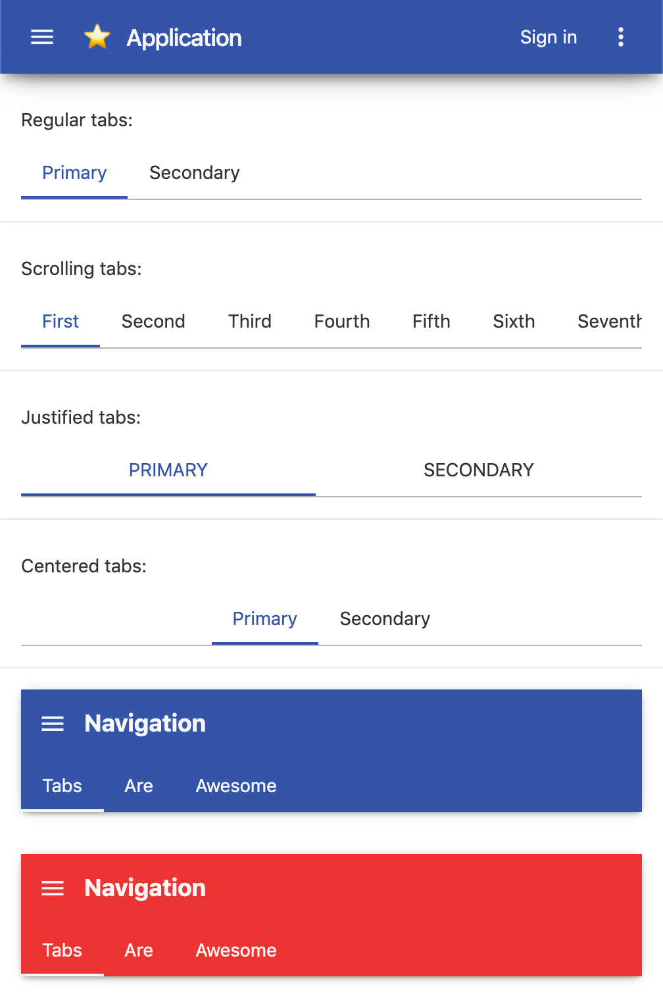

# Typescene web app navigation components

This package contains the following components:

- `AppLayout` and friends:
  - `AppDrawer`
  - `AppHeader`
  - `AppMenuButton`
  - `AppTitle`
  - `AppToolbar`
- `TabBar`, and
  - `TabBarButton`

> **Note:** The names above are for the JSX tags. If your code does not use JSX (i.e. `.tsx` files), then the same names will still work, but you can also import the corresponding `...View` components instead.

## Installation

**Note:** This component requires [Typescene](https://github.com/typescene/typescene) along with `@typescene/webapp`.

Install the NPM package first:

`npm i -D @typescene/web-nav`

Then import any of the classes using an import statement such as:

`import { AppLayoutView } from "@typescene/web-nav"`

## Example

The following example demonstrates how the `AppLayout` component can be used with JSX-style code:

```jsx
const myAppView = (
  <AppLayout>
    {/* Drawer, automatically shown using AppMenuButton */}
    <AppDrawer>
      <flowcell dimensions={{ height: 180 }}>
        <row>{/* drawer header */}</row>
      </flowcell>
      <scrollcontainer>
        <flowcell>
          <row>{/* scrollable area */}</row>
        </flowcell>
      </scrollcontainer>
    </AppDrawer>

    {/* Fixed header bar */}
    <AppHeader>
      <AppMenuButton />
      <AppTitle>Title</AppTitle>
      <AppToolbar>
        <iconbutton icon="...">
        {/* buttons... */}
      </AppToolbar>
    </AppHeader>

    {/* Remaining content... */}
    <flowcell padding={16}>
      <centerrow>
        <p>Hello, world!</p>
      </centerrow>
    </flowcell>
  </AppLayout>
);
```

Tabs can be used as follows (note that the tab 'content' is not part of the tab bar component, so you can use e.g. a state property on the Activity class to toggle between content views directly below the tab bar):

```jsx
(
  <TabBar>
    <TabBarButton onSelect="..." selected>
      First tab
    </TabBarButton>
    <TabBarButton onSelect="...">
      Second tab
    </TabBarButton>
  </TabBar>
  {/* ... put tab content here ... */}
)
```

## Demo

The `demo/` folder contains more examples that show how to use these components.



To run the demo, clone the source repository and run the following commands in the terminal:

```bash
npm install
npm run build
cd demo
npm install
npm start
```
